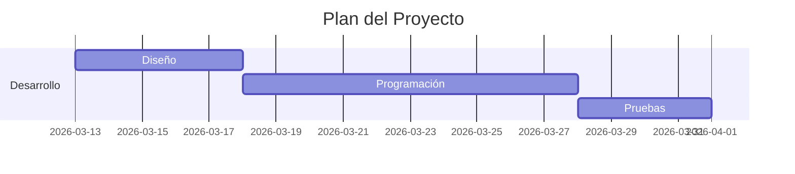

# Guía: Crear Diagramas con Mermaid en GitHub

## Introducción

**Mermaid** es una herramienta que permite crear diagramas a partir de texto utilizando una sintaxis sencilla. GitHub es compatible con Mermaid de forma nativa, lo que significa que puedes escribir el código del diagrama en un archivo Markdown y GitHub lo renderizará automáticamente como un diagrama visual.

Esto resulta muy útil para documentar:

- Arquitectura de sistemas
- Flujos de procesos
- Interacción entre componentes
- Diseño de clases
- Planificación de proyectos

Mermaid puede utilizarse en:

- `README.md`
- Wikis de GitHub
- Issues
- Pull Requests
- Documentación técnica en Markdown

---

# 1. Cómo crear un diagrama Mermaid en GitHub

## Paso 1: Abrir o crear un archivo Markdown

Primero debes abrir un archivo Markdown dentro de tu repositorio. Algunos ejemplos comunes son:

- `README.md`
- `docs/gantt.md`
- páginas dentro de la **Wiki de GitHub**

---

## Paso 2: Crear un bloque de código Mermaid

Para crear un diagrama debes utilizar un **bloque de código** indicando el lenguaje `mermaid`.

Para este ejemplo usaremos un diagrama Gantt:

Este diagrama permite visualizar:

Tareas, Duración, Dependencias entre actividades

---

## Referencias

* [Usando Mermaid en GitHub](https://medium.com/@victormanuellagunas/usando-mermaid-en-github-%EF%B8%8F-bed40600c7f4)
* [About Mermaid](https://mermaid.js.org/intro/)

